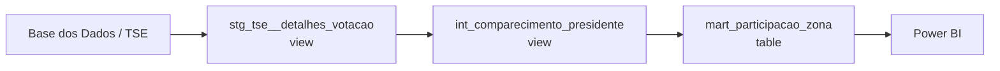
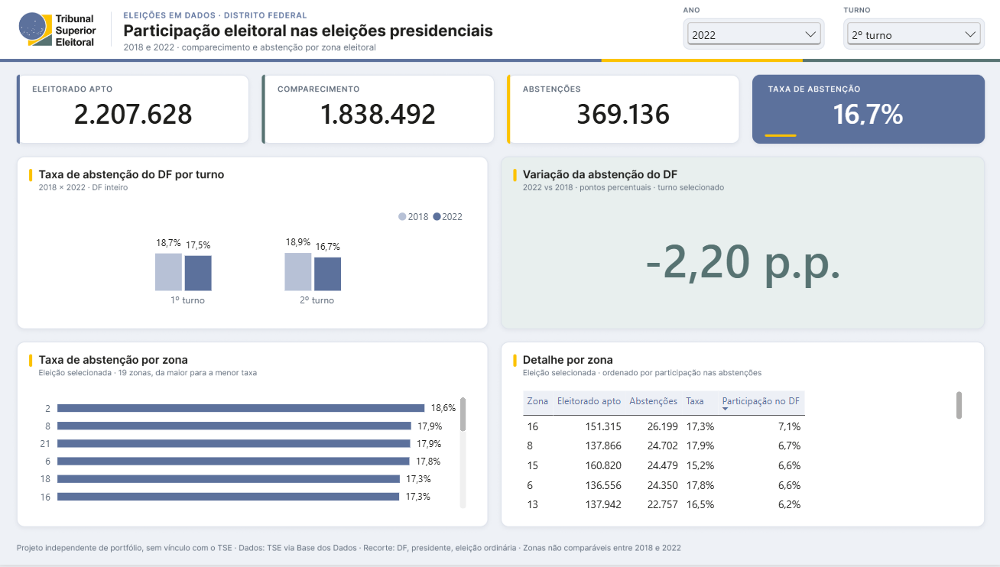

# Eleições em dados

Projeto de analytics engineering com dados eleitorais públicos: **BigQuery** como armazém, **dbt** para transformação, testes e documentação, e **Power BI** para o dashboard.

> **Versão 1 — 29/09/2026:** mart construído e verificado contra a fonte; `dbt build` aprovado com 3 modelos e 27 testes (`PASS=30 WARN=0 ERROR=0`); dashboard montado e conferido, com projeto Power BI e imagens disponíveis neste repositório.

## Introdução

O TSE publica, por zona eleitoral, quantos eleitores estavam aptos, quantos compareceram e quantos se abstiveram. O dado bruto repete essas contagens para cada cargo e mistura eleições ordinárias e suplementares, então somá-lo sem cuidado gera números errados.

Este projeto transforma esse dado em uma tabela confiável de **eleitorado apto, comparecimento e abstenção por zona eleitoral do Distrito Federal**, nas eleições presidenciais de 2018 e 2022, e só deixa o número chegar ao dashboard depois de passar por testes.

## Fonte

| | |
|---|---|
| Conjunto | Eleições Brasileiras — [Base dos Dados](https://basedosdados.org/), dados originais do TSE |
| Tabela | `basedosdados.br_tse_eleicoes.detalhes_votacao_municipio_zona` |
| Região | `US` |
| Organização física | Particionada por `ano` (faixa inteira), clusterizada por `sigla_uf` |
| Acesso | Grátis (cobertura 1994–2024) |

O projeto **não** faz a ingestão dos arquivos originais do TSE: consome a tabela já publicada no BigQuery. Validação completa da fonte: [`docs/validacao-fonte.md`](docs/validacao-fonte.md).

## Recorte

| Dimensão | Escolha | Motivo |
|---|---|---|
| UF | `DF` | Ligação com a experiência no TRE-DF |
| Anos | `2018`, `2022` | Eleições gerais recentes (o DF não tem eleição municipal) |
| Turnos | `1` e `2` | Presidente teve 2º turno nos dois anos |
| Cargo | `presidente` | A fonte repete aptos e comparecimento por cargo; fixar um cargo evita contagem múltipla |
| Tipo de eleição | `eleicao ordinaria` | Confirmado na validação da fonte |

**Uma linha do mart** = uma zona eleitoral do DF em um ano e turno. Chave: `ano + turno + zona`. São 76 linhas: 19 zonas em cada uma das 4 eleições.
Contrato completo (colunas, tipos, fórmulas e regras de uso): [`docs/contrato-dados.md`](docs/contrato-dados.md).

## Arquitetura



- **Staging** — recorte DF 2018/2022, nomes normalizados (`aptos` → `eleitorado_apto`), texto aparado e em minúsculas.
- **Intermediate** — fixa presidente, eleição ordinária e turnos 1 e 2.
- **Mart** — seleciona 11 colunas explicitamente e calcula `taxa_comparecimento`, `taxa_abstencao` (`SAFE_DIVIDE`) e a chave `chave_zona_eleicao_turno`, totalizando as 14 colunas do contrato. Sem agregação nem `DISTINCT`: a unicidade é verificada, não forçada.

Tabela final: `eleitorado.eleicoes_em_dados.mart_participacao_zona`.

## Testes

Duas camadas, escritas por agentes diferentes para que uma revise a outra:

- **Genéricos** (em `models/schema.yml`): not_null, valores aceitos e unicidade da chave. 18 testes.
- **Singulares independentes** (em `tests/`), que não reutilizam os modelos intermediários:

| Teste | Verifica |
|---|---|
| T01 | Campos obrigatórios sem NULL |
| T02 | Chave natural única e chave concatenada coerente |
| T03 | Domínios do recorte (DF, anos, turnos, cargo, tipo, zona como texto) |
| T04 | As 4 eleições presentes, cada uma com 19 zonas |
| T05 | `eleitorado_apto = comparecimento + abstencoes` em cada linha |
| T06 | Contagens não negativas e limitadas ao eleitorado apto |
| T07 | Taxas em [0, 1], complementares e iguais ao recálculo |
| T08 | Totais por eleição iguais aos totais de referência calculados da fonte |
| T09 | Comparação linha a linha do mart com a fonte |

**Resultado:** `dbt build` com 3 modelos e 27 testes (18 genéricos + T01–T09) aprovados, `PASS=30 WARN=0 ERROR=0`.

Há também uma **demonstração controlada**, desativada por padrão: acrescenta quatro linhas sintéticas em CTEs, representando três casos inválidos (um deles duplicado), sem criar tabelas. Executada pelo dbt, ela **falhou com exatamente 3 violações** (conciliação, taxa fora do intervalo e chave duplicada), como esperado. Isso demonstra a detecção desses três tipos de erro.

Um achado da revisão independente, o `select *` no mart, foi corrigido: o mart passou a listar as colunas do contrato. Detalhes e evidências: [`docs/revisao-qualidade.md`](docs/revisao-qualidade.md).

## Custo e benchmark

O projeto roda no **BigQuery sandbox, sem faturamento**. Toda consulta é estimada por dry run antes de executar, e o profile do dbt limita cada job a 100 MB.

| Experimento | Bytes processados |
|---|---|
| Fonte, `SELECT *` no recorte | 17.180.996 |
| Fonte, só as 6 colunas necessárias | 6.500.065 (−62,2%) |
| Cópia do mart sem partição, filtro por ano | 2.704 |
| Cópia do mart particionada por ano, mesmo filtro | 1.352 (−50%) |

Selecionar colunas e filtrar a partição reduziram os bytes lidos neste experimento. Nas três cópias de laboratório com 76 linhas, os jobs reportaram os mesmos 10 MiB de bytes faturados, apesar da diferença de leitura. Essa conclusão não se aplica a todas as consultas à fonte, e não representa economia financeira comprovada no sandbox. Método e limites: [`docs/benchmark.md`](docs/benchmark.md).

## Dashboard

Abra [`dashboard/eleicoes-em-dados.pbip`](dashboard/eleicoes-em-dados.pbip) no Power BI Desktop, mantendo as pastas `.Report` e `.SemanticModel` juntas. Essa é a versão oficial do relatório; os visuais estão em PBIR e o modelo/medidas em TMDL. As imagens abaixo permitem consultar o resultado sem autenticação Google.

Para atualizar em outra conta, reconstrua o mart no seu projeto, ajuste `BillingProject` e o projeto na consulta Power Query, autentique com sua conta Google e atualize o modelo. Caches locais e credenciais não são distribuídos; abrir o projeto pode exigir atualização dos dados. O `.pbix` inicial não contém os visuais finais e não faz parte da entrega pública.

Uma página no Power BI conectada ao mart (modo Import) com:

- cartões da eleição selecionada;
- taxa de abstenção do DF por turno, 2018 × 2022;
- variação do DF em pontos percentuais;
- ranking e detalhe das zonas dentro da eleição.

As medidas DAX foram conferidas contra os totais de referência e as análises SQL, e todas bateram.



Os valores exibidos foram conferidos, visual por visual, contra os totais de referência e as análises SQL em 2022/2º turno e 2018/2º turno. Layout, medidas e conferência: [`dashboard/layout.md`](dashboard/layout.md). Roteiro de apresentação de 2 minutos: [`docs/apresentacao/roteiro-2min.md`](docs/apresentacao/roteiro-2min.md).

## Como reproduzir

Resumo (PowerShell, na raiz do repositório):

```powershell
python -m venv .venv
.\.venv\Scripts\python.exe -m pip install -r requirements-lock.txt
gcloud auth application-default login
New-Item -ItemType Directory -Force .local
Copy-Item profiles.example.yml .local/profiles.yml
$env:BIGQUERY_PROJECT = 'seu-projeto'
$env:DBT_DATASET = 'eleicoes_em_dados'
.\.venv\Scripts\dbt.exe build --profiles-dir .local
```

Passo a passo completo, com preflight de custo, análises e benchmark: [`docs/reproducao.md`](docs/reproducao.md).

### Restrições do ambiente (BigQuery sandbox)

- Sem DML: nada de materialização incremental nem snapshots do dbt, só `view` e `table`.
- 10 GiB de armazenamento, e tabelas expiram em 60 dias. Por isso o projeto precisa ser reconstruível com `dbt build`.
- Cota mensal de consulta: selecionar colunas e filtrar pelas partições.

## Observações

Resultados descritivos do recorte. Nenhuma causa é atribuída a partir desses agregados.

1. **A abstenção do DF caiu entre 2018 e 2022 nos dois turnos:** de 18,70% para 17,54% no 1º turno (−1,16 p.p.) e de 18,92% para 16,72% no 2º (−2,20 p.p.).
2. **Os dois anos se comportaram de forma oposta entre turnos:** em 2018 o comparecimento caiu 0,22 p.p. do 1º para o 2º turno; em 2022 subiu 0,82 p.p.
3. **Dentro de uma mesma eleição, as zonas variam bastante:** no 2º turno de 2022, a taxa de abstenção foi de 14,95% (zona 3) a 18,60% (zona 2), uma diferença de 3,65 p.p.

As zonas **não** são comparadas entre 2018 e 2022: o identificador se repete, mas a continuidade territorial não foi comprovada.

## Conclusão

O projeto entrega uma camada de transformação em BigQuery/dbt, 27 testes de qualidade e um dashboard Power BI com indicadores conciliados. A validação independente confirma as 76 linhas do recorte e a reprodução foi testada em um dataset separado.

Para o portfólio, a evidência é o conjunto de SQL, modelos, testes, medidas e resultados registrados. Ingestão própria dos arquivos do TSE, orquestração e atualização automática ficam para uma próxima versão. O projeto é independente, sem vínculo institucional com o TSE.
