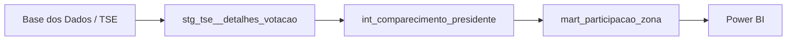

# Reprodução do projeto

## Ambiente

Windows, Python 3.12.10, dbt Core 1.12.5, dbt-bigquery 1.12.1. Dependências diretas em `requirements.txt`; ambiente completo em `requirements-lock.txt`.

Pré-requisitos: projeto Google Cloud com BigQuery sandbox, permissões para jobs e criação de datasets/tabelas no seu projeto, acesso à fonte pública e Google Cloud CLI para autenticação local. Não ativar faturamento. Os limites gratuitos e expiração do sandbox exigem reconstrução periódica; não é uma hospedagem permanente.

## Configurar uma vez (PowerShell)

Execute os comandos na raiz do repositório:

```powershell
python -m venv .venv
.\.venv\Scripts\python.exe -m pip install -r requirements-lock.txt
gcloud auth application-default login
New-Item -ItemType Directory -Force .local
Copy-Item profiles.example.yml .local/profiles.yml
$env:BIGQUERY_PROJECT = 'eleitorado' # substituir ao reproduzir em outro projeto
$env:GOOGLE_CLOUD_PROJECT = $env:BIGQUERY_PROJECT
$env:DBT_DATASET = 'eleicoes_em_dados'
$env:DBT_SEND_ANONYMOUS_USAGE_STATS = 'false'
.\.venv\Scripts\dbt.exe debug --profiles-dir .local
```

O projeto/dataset do profile são parametrizáveis. Os scripts Python de evidências usam o projeto `eleitorado`, como o experimento original; adaptar esse valor antes de executá-los com outra conta/projeto. A região é US porque a fonte está em US. Credenciais OAuth ficam fora do repositório. O profile local é ignorado pelo Git; o exemplo não contém segredo.

## Construir e testar

```powershell
.\.venv\Scripts\dbt.exe compile --profiles-dir .local
.\.venv\Scripts\python.exe analyses/preflight_dbt.py
.\.venv\Scripts\dbt.exe build --profiles-dir .local
.\.venv\Scripts\dbt.exe docs generate --profiles-dir .local
```

Após configuração, `dbt build --profiles-dir .local` reconstrói as views, o mart e executa os testes. Compilar e executar o preflight antes de consultas novas ou alteradas atende à política de conferir bytes estimados. O profile limita cada job a 100.000.000 bytes faturados; isso não substitui o acompanhamento da cota mensal gratuita.

O preflight expande as dependências para a fonte, permitindo estimar mesmo antes da primeira criação das views. Para testes do mart essa estimativa é conservadora: a execução real lê a tabela pequena materializada. Ele aborta se a estimativa for desconhecida ou exceder o limite.

## Demonstração de falha controlada

O teste `demo_falha_qualidade` fica desativado por padrão. Quando habilitado, injeta dados apenas em CTEs e deve retornar **3 violações** (conciliação, taxa e chave duplicada), sem gravar essas linhas no mart.

```powershell
.\.venv\Scripts\dbt.exe compile --select demo_falha_qualidade --vars '{demo_falha: true}' --profiles-dir .local
.\.venv\Scripts\python.exe analyses/preflight_dbt.py
.\.venv\Scripts\dbt.exe test --select demo_falha_qualidade --vars '{demo_falha: true}' --profiles-dir .local
# Esperado: exit code 1 e FAIL 3 (o teste detectou os erros injetados).
# Restaurar a documentação e o manifest com a demonstração desativada:
.\.venv\Scripts\dbt.exe docs generate --profiles-dir .local
```

Um erro de compilação/conexão não equivale ao resultado esperado: o teste precisa executar e registrar `failures: 3`. O build normal deve continuar com todos os testes aprovados.

## Análises e benchmark

```powershell
.\.venv\Scripts\python.exe analyses/validar_fonte.py
.\.venv\Scripts\python.exe analyses/executar_analises.py
.\.venv\Scripts\python.exe analyses/verificar_mart.py
.\.venv\Scripts\python.exe analyses/benchmark.py
```

Executar análises após `dbt compile` e com o mart construído. Todos os scripts fazem dry run antes de executar SQL e salvam IDs dos jobs e bytes em `analyses/evidencias/`. O benchmark cria três tabelas `lab_benchmark_*` de 76 linhas com expiração em 24 horas. Não confundir esses objetos temporários com o mart final; repetir o benchmark só quando necessário.

## Reconstrução sem apagar o mart principal

```powershell
$env:DBT_DATASET = 'eleicoes_em_dados_verificacao'
.\.venv\Scripts\dbt.exe compile --profiles-dir .local
.\.venv\Scripts\python.exe analyses/preflight_dbt.py
.\.venv\Scripts\dbt.exe build --profiles-dir .local
$env:DBT_DATASET = 'eleicoes_em_dados'
.\.venv\Scripts\dbt.exe compile --profiles-dir .local
.\.venv\Scripts\dbt.exe docs generate --profiles-dir .local
```

## Power BI e validação

- Projeto: `eleitorado`; dataset: `eleicoes_em_dados`; tabela: `mart_participacao_zona`; região US.
- Consultar `docs/contrato-dados.md` antes de implementar medidas e testes.
- Coluna de aptos: `eleitorado_apto`. Taxas FLOAT64 entre 0 e 1.
- Totais independentes em `docs/validacao-fonte.md`; resultados das análises em `analyses/evidencias/analises.json` quando executadas.
- Não somar anos/turnos como pessoas únicas; não comparar territórios das zonas entre anos sem verificar continuidade.
- Manter README, testes e dashboard alinhados ao contrato de dados e executar a suíte após alterações.
- A entrega oficial é `dashboard/eleicoes-em-dados.pbip` com as pastas `.Report` (PBIR) e `.SemanticModel` (TMDL). O `.pbix` local inicial não contém os visuais finais e está excluído do Git, assim como caches `.pbi/`.

## Estado da execução

Primeira construção concluída em 29/09/2026: **3 modelos + 18 testes genéricos aprovados**, sem erro ou aviso. Evidência: `analyses/evidencias/construcao.json`.

Mart disponível: **eleitorado.eleicoes_em_dados.mart_participacao_zona**, 76 linhas. Verificação independente linha a linha contra a fonte aprovada, incluindo contagens, chave, cobertura e taxas: `analyses/evidencias/verificacao_eleicoes_em_dados.json`.

As cinco análises foram executadas e o benchmark concluído. A reconstrução no dataset `eleicoes_em_dados_verificacao` também passou nos 3 modelos e 18 testes; as 76 linhas foram novamente comparadas à fonte. Evidências: `analyses/evidencias/reconstrucao.json` e `verificacao_eleicoes_em_dados_verificacao.json`.

`dbt docs generate` concluiu e gerou o catálogo com os três modelos e as 14 colunas do mart. Houve um aviso da biblioteca agate sobre `table_owner`, mas o catálogo não contém erros e foi conferido. Resumo público em `analyses/evidencias/documentacao.json`; catálogo e interface local em `target/`.

Integração da segunda rodada concluída em 29/09/2026: **3 modelos + 27 testes aprovados (18 genéricos + T01–T09)**, `PASS=30 WARN=0 ERROR=0`. Evidência: `analyses/evidencias/build_integrado.json`. O mart passou a listar explicitamente as 14 colunas do contrato, conforme sugestão da revisão independente.

Demonstração executada via dbt: **FAIL 3**, exit code 1, exatamente como esperado; não foi erro de conexão ou compilação. Dry run da demo: 3920 bytes. Evidência separada em `analyses/evidencias/demo_qualidade.json`. O manifest e a documentação foram regenerados com a demo novamente desativada e os 27 testes normais disponíveis.

Os testes e a demonstração estão integrados. O dashboard em PBIP está concluído, com conferência das medidas nas quatro eleições e dos visuais em 2022/2º e 2018/2º turno. A revisão final incluiu as duas imagens contra os totais de referência, os dez visuais, as nove medidas e os arquivos e links da entrega.

Destino público da versão 1: [Deyv7/eleicoes-em-dados](https://github.com/Deyv7/eleicoes-em-dados). O repositório distribui as definições do relatório e imagens, sem caches locais, credenciais ou o PBIX inicial. Para reproduzir o Power BI, abra o PBIP, ajuste o projeto na consulta Power Query e autentique/atualize com sua própria conta. Não há dependência de Power BI Service pago.

### Linhagem esperada



Para consultar documentação local após gerar: `.\.venv\Scripts\dbt.exe docs serve --profiles-dir .local`. Os artefatos ficam em `target/`, ignorados pelo Git.

### Entrega final

A entrega reúne validação da fonte, transformações, benchmark, testes de qualidade, reprodução, modelo e visuais do Power BI, imagens, README e materiais de apresentação. A revisão editorial final corrigiu a contagem de linhas sintéticas na demo, distinguiu bytes lidos de bytes faturados e documentou PBIP como formato oficial. O roteiro de vídeo está pronto; a gravação não faz parte dos arquivos entregues.

Para apresentação, as taxas de abstenção do DF foram 18,7025% (2018/1), 18,9201% (2018/2), 17,5395% (2022/1) e 16,7209% (2022/2). Queda de 1,1630 p.p. no primeiro turno e 2,1992 p.p. no segundo, comparando 2022 a 2018. Valores completos em `analises.json`; não atribuir causas com base apenas nesses agregados.
